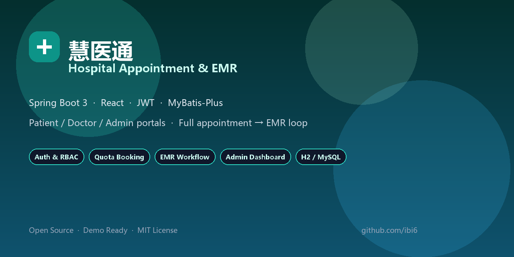
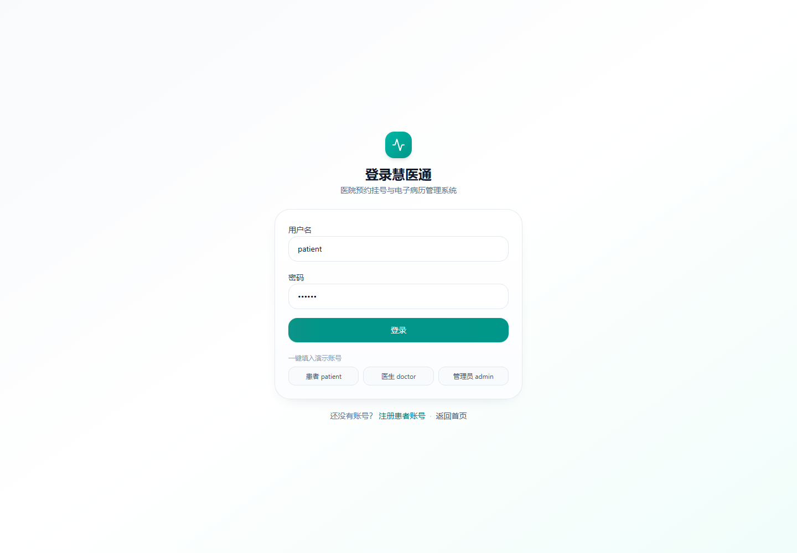
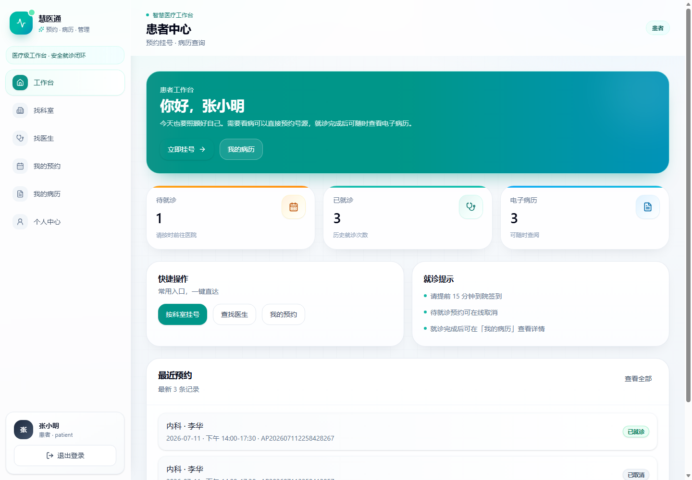
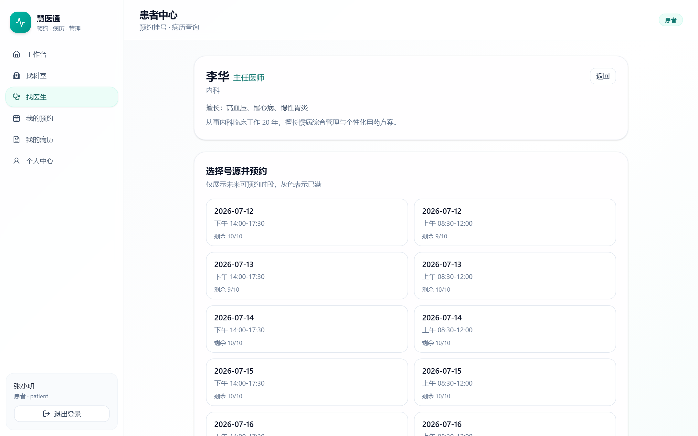
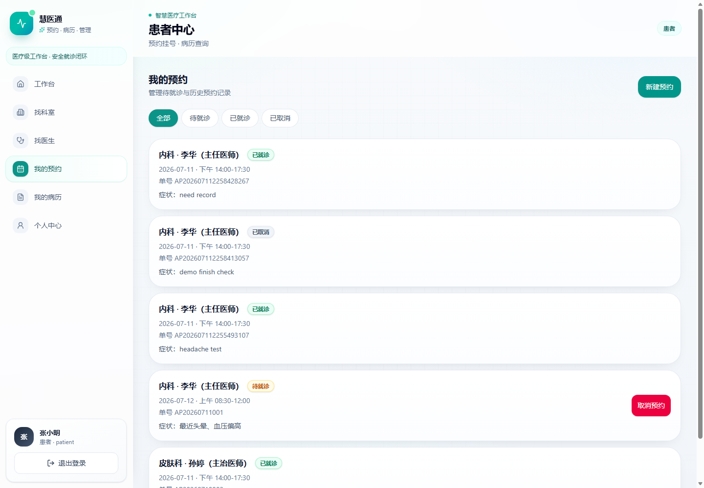
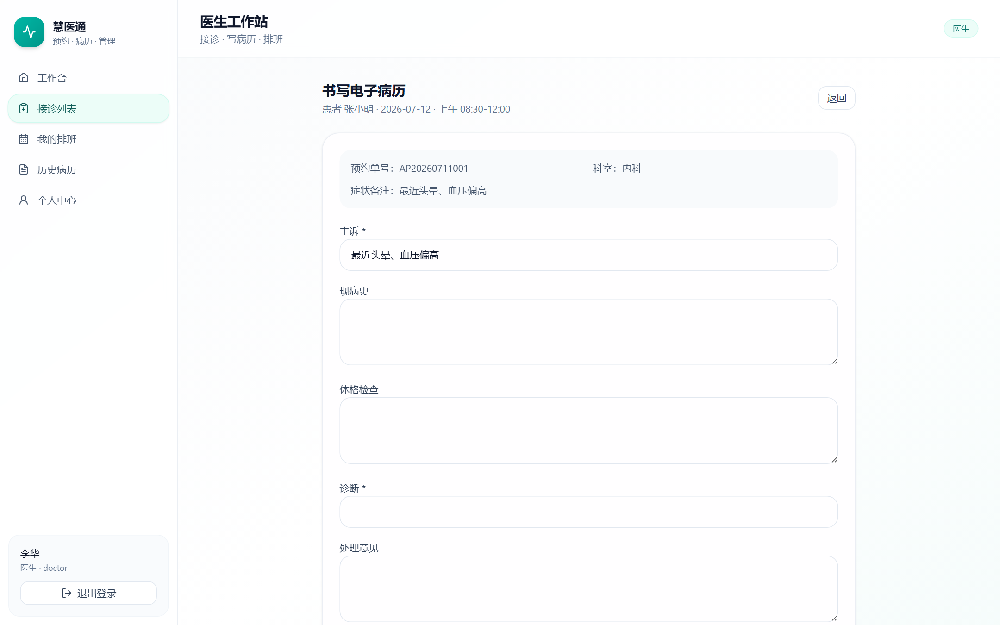
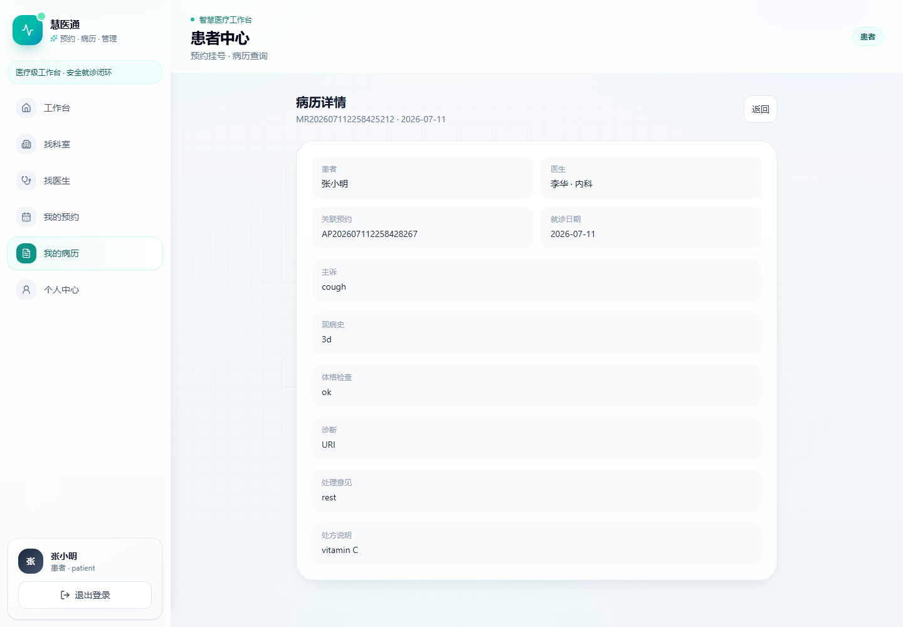
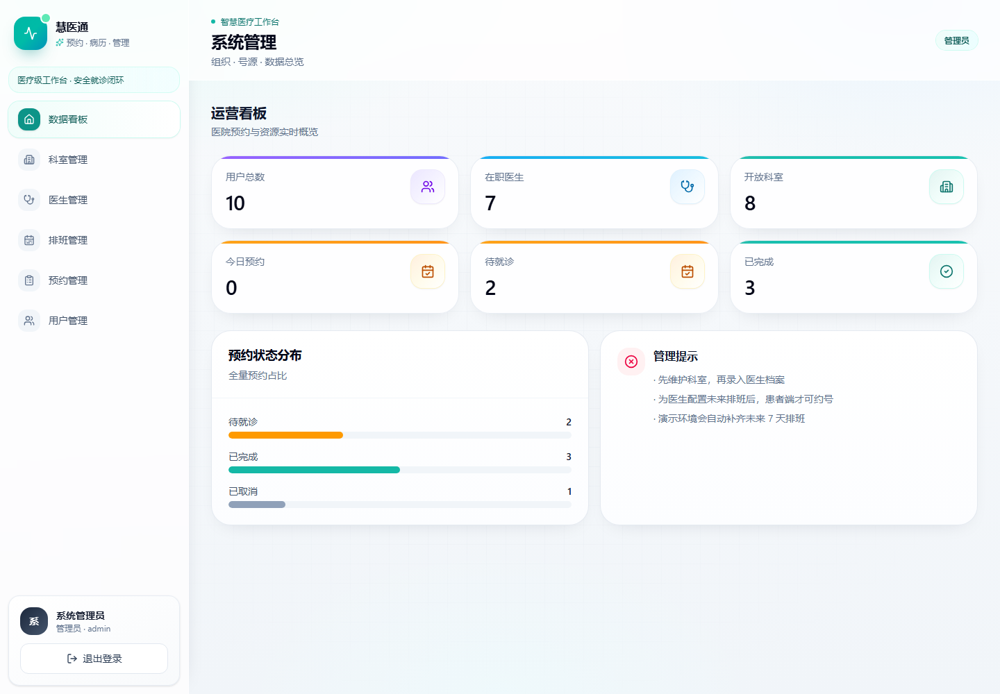
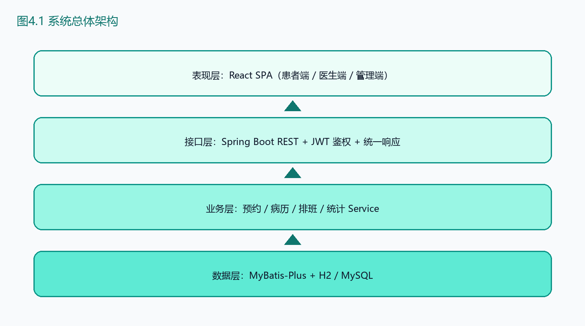
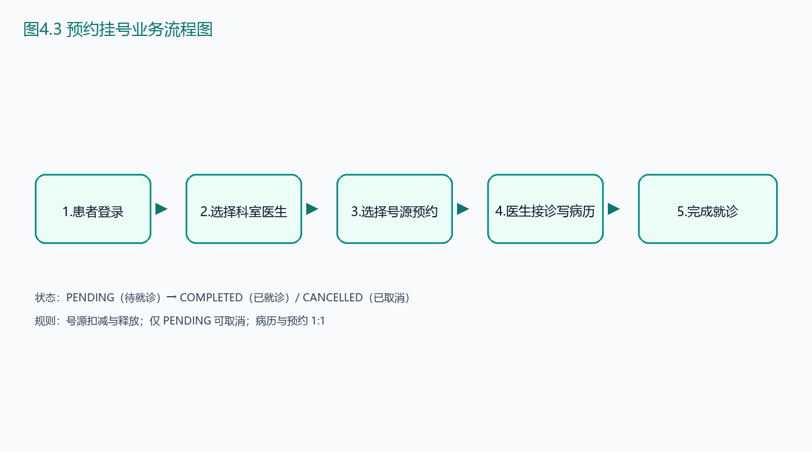

<div align="center">

# 🏥 慧医通 · Hospital Appointment & EMR

### Design and Implementation of a Hospital Appointment Registration  
### & Electronic Medical Record Management System

**Spring Boot 3 · React · JWT · MyBatis-Plus · H2 / MySQL**

<p>
  <a href="./README.md">English</a> ·
  <a href="./README.zh-CN.md">简体中文</a>
</p>

<p>
  
  
  
</p>

<p>
  
  
  
  
  
  
</p>

<p align="center">
  <a href="#-features">Features</a> ·
  <a href="#-screenshots">Screenshots</a> ·
  <a href="#-architecture">Architecture</a> ·
  <a href="#-quick-start">Quick Start</a> ·
  <a href="#-api-overview">API</a> ·
  <a href="#-demo-accounts">Demo</a>
</p>



<br/>



<sub>Full-stack hospital workflow: appointment booking → doctor consultation → electronic medical records → admin operations</sub>

</div>

---

## ✨ Why this project

Most student “hospital systems” stop at CRUD forms.  
This project ships a **runnable product loop**:

| Capability | What you get |
|---|---|
| 🔐 Real auth | Spring Security + JWT + role isolation |
| 📅 Real booking | Quota reserve / release with status machine |
| 📝 Real EMR | Appointment → medical record (1:1) |
| 🎛️ Three portals | Patient / Doctor / Admin in one SPA |
| 🐳 Deploy options | H2 zero-deps demo **or** MySQL + Docker |
| ✅ Tests | Integration tests for core API paths |

---

## 🧩 Features

### Patient
- Register / login
- Browse departments & doctors
- Book / cancel appointments
- View personal electronic medical records

### Doctor
- Consultation workbench
- Write structured EMR (complaint, diagnosis, treatment, prescription)
- View schedules & history records

### Admin
- KPI dashboard
- Department / doctor / schedule CRUD
- Appointment & user management

### Engineering
- Unified API response `{ code, message, data }`
- Global exception handling
- Seed data for instant demo
- Swagger UI
- Env-based secrets (`.env.example`)

---

## 🖼️ Screenshots

| Patient Dashboard | Book Appointment |
|:---:|:---:|
|  |  |
| **My Appointments** | **Doctor EMR** |
|  |  |
| **Record Detail** | **Admin Dashboard** |
|  |  |

---

## 🏗 Architecture

```text
┌──────────────────────┐      HTTPS/JSON       ┌──────────────────────────┐
│  React SPA (Vite)    │ ───────────────────▶ │  Spring Boot 3 API       │
│  Patient/Doctor/Admin│ ◀─────────────────── │  Security + JWT          │
└──────────────────────┘                      │  MyBatis-Plus Services   │
                                              └────────────┬─────────────┘
                                                           │
                                              ┌────────────▼─────────────┐
                                              │  H2 (default) / MySQL 8  │
                                              └──────────────────────────┘
```

<div align="center">
  
  <br/>
  
</div>

### Tech Stack

| Layer | Technology |
|------|------------|
| Frontend | React 18, TypeScript, Vite, Tailwind CSS, React Router, lucide-react |
| Backend | Spring Boot 3, Spring Security, JWT, Validation, springdoc OpenAPI |
| Persistence | MyBatis-Plus, H2 file DB (default), MySQL 8 (optional) |
| Ops | Docker Compose (MySQL), PowerShell start scripts |

---

## 🚀 Quick Start

### Requirements
- **JDK 21+**
- **Node.js 18+**
- **Maven 3.9+**

### 1) Backend

```bash
cd backend
mvn -DskipTests package
java -jar target/hospital-backend-1.0.0.jar
```

- API: http://localhost:8080  
- Swagger: http://localhost:8080/swagger-ui.html  

### 2) Frontend

```bash
cd frontend
npm install
npm run dev
```

- App: http://localhost:5173  

### Windows one-liners

```powershell
powershell -File scripts/start-backend.ps1
powershell -File scripts/start-frontend.ps1
```

### Optional: MySQL + Docker

```powershell
powershell -File scripts/start-mysql.ps1
powershell -File scripts/start-backend.ps1 mysql
```

> Configure secrets via environment variables. See [`.env.example`](./.env.example).

---

## 👤 Demo Accounts

| Username | Password | Role |
|----------|----------|------|
| `patient` | `123456` | Patient |
| `doctor` | `123456` | Doctor |
| `admin` | `123456` | Admin |

> Demo only. Change credentials before any production use.

### 3-minute demo path

1. Login as **patient** → book an appointment  
2. Login as **doctor** → write EMR and complete visit  
3. Login as **patient** → open medical record  
4. Login as **admin** → check dashboard & management pages  

---

## 🔌 API Overview

Base path: `/api`

| Module | Endpoints (selected) |
|--------|----------------------|
| Auth | `POST /auth/login` `POST /auth/register` `GET /auth/me` |
| Departments | `GET/POST/PUT /departments` |
| Doctors | `GET/POST/PUT /doctors` |
| Schedules | `GET/POST/PUT /schedules` |
| Appointments | `GET/POST /appointments` `POST /appointments/{id}/cancel` |
| Records | `GET/POST /records` `GET /records/by-appointment/{id}` |
| Users | `GET /users` `PUT /users/{id}/status` |
| Stats | `GET /stats/overview` |

Auth header:

```http
Authorization: Bearer <jwt>
```

---

## 🧪 Tests

```bash
cd backend
mvn test
```

Core coverage:
- login success / failure  
- role-based access denial  
- patient data isolation  
- appointment → EMR completion  
- admin stats  

---

## 📁 Project Structure

```text
.
├── backend/                 # Spring Boot API
│   ├── src/main/java/com/hospital/
│   │   ├── controller/      # REST endpoints
│   │   ├── service/         # Business logic & isolation
│   │   ├── security/        # JWT + Spring Security
│   │   ├── entity/ mapper/  # Domain & persistence
│   │   └── config/          # Schema init + seed data
│   └── src/test/            # Integration tests
├── frontend/                # React SPA
│   └── src/
│       ├── pages/           # patient / doctor / admin portals
│       ├── components/      # UI + layout
│       ├── services/        # API client
│       └── context/         # Auth state
├── docs/                    # Specs, demo guide, screenshots
├── docker/                  # MySQL init SQL
├── scripts/                 # Local start helpers
├── docker-compose.yml
└── README.md
```

---

## 🔐 Security Notes

- Passwords stored with **BCrypt**
- Stateless **JWT** authentication
- Role guards on frontend routes & backend APIs
- Patients/doctors restricted to own data at service layer
- Secrets externalized (`APP_JWT_SECRET`, datasource envs)

---

## 🗺 Roadmap

- [ ] Payment / insurance modules  
- [ ] SMS / email notifications  
- [ ] Queue / call-number system  
- [ ] Full-stack Docker Compose (frontend + backend + MySQL)  
- [ ] CI pipeline (build + test)

---

## 📄 License

MIT — see [LICENSE](./LICENSE).

---

<div align="center">

**If this project helps you, consider giving it a ⭐**

Built with Spring Boot & React · Ready for demo · Open for learning

[English](./README.md) · [简体中文](./README.zh-CN.md)

</div>
